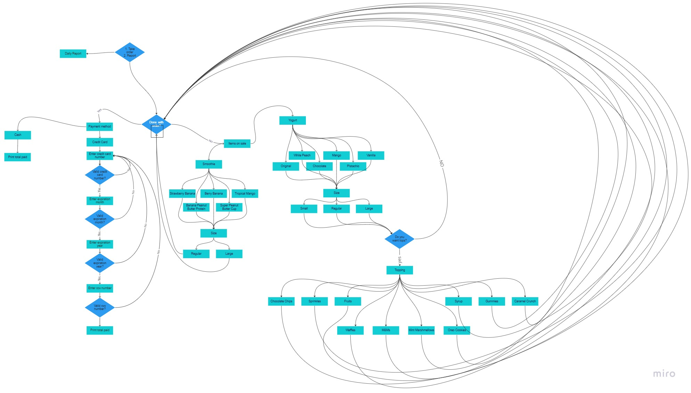

# 🍧 YSSI
Yogurt & Smoothie Shops Inc. (YSSI) sells yogurt & smoothies. Customers will buy yogurts & smoothies in YSS through the computer system. The system takes orders, processes payments, and generates a sales report at the end of the day. YSSI will be responsible for changing the sizes, flavors, and toppings listed on the menu, based upon availability. It will also not handle the network infrastructure in the brick-and-mortar store, to process payments and communicate with other devices. For example, routers, CAT5e/CAT6 ethernet cables for wired connections, and Wi-Fi 5/Wi-Fi 6 access points, are all up to YSSI to provide.

